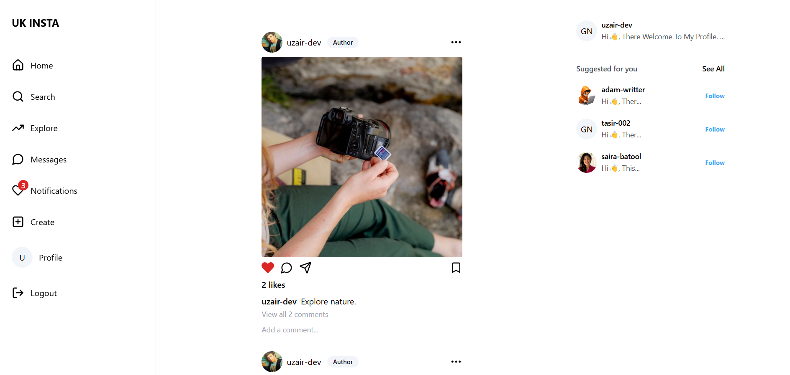

# Instagram Clone

This is a full-stack Instagram clone built using the MERN (MongoDB, Express, React, Node.js) stack. The app allows users to create accounts, share images, follow other users, like posts, and engage in real-time interactions.



## Tech Stack

- **Frontend**: React, Redux-toolkit, shadcn, tailwind css.
- **Backend**: Node.js, Express
- **Database**: MongoDB
- **Real-time**: SocketIO

## Features

- **User Authentication**: Users can sign up, log in, and manage their profiles.
- **Photo Upload**: Upload images to share with followers.
- **Like and Comment**: Engage with posts through likes and comments.
- **Real-time Notifications**: Notifications for likes, comments, and follows.
- **Responsive Design**: Optimized for various screen sizes.

## Installation

0. **Note**
   Rename the example.env file to just env and provide the all variable.

1. **Clone the repository**

   ```bash
   git clone https://github.com/UzairKhan313/mern-instagram-clone.git
   cd mern-instagram-clone
   ```

2. **Install the Dependecies on Both side client and server**

```bash
  npm install setup project
```

3. **Install the Dependecies on Both side client and server**

```bash
  npm install setup project
```
